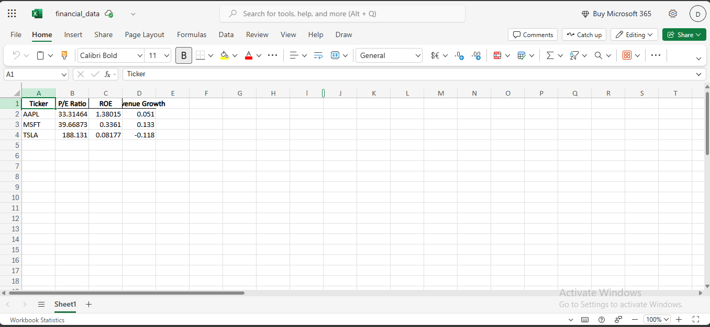
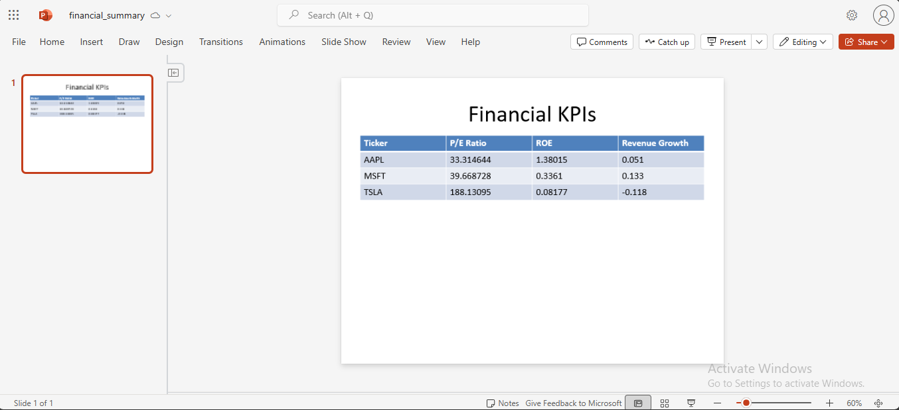

# 📊 Financial Data Automation Pipeline

This project automates the extraction and reporting of key financial KPIs for public companies. It uses Python to pull market data, calculate metrics like P/E Ratio, ROE, and Revenue Growth, and generate both an Excel report and a PowerPoint slide — simulating a real-world equity research or financial analyst workflow.

---

## 🚀 Features

- 🔄 Fetches real-time market data using Yahoo Finance API (`yfinance`)
- 📈 Calculates financial KPIs: **P/E Ratio**, **ROE**, **Revenue Growth**
- 📊 Exports KPI data to Excel (`.xlsx`)
- 🖼️ Auto-generates a PowerPoint summary slide with a dynamic table
- ⚙️ Modular Python code, easy to run and customize

---

## 🛠️ Tech Stack

- `Python 3.x`
- `yfinance`
- `pandas`
- `openpyxl`
- `python-pptx`

---

## 📁 Project Structure

```
financial-data-automation/
├── data/
│   └── financial_data.xlsx        # Generated Excel output
├── output/
│   └── financial_summary.pptx     # Generated PowerPoint report
├── main.py                        # Main Python script
├── requirements.txt               # List of dependencies
├── screenshots/                   # Output images (optional)
└── README.md                      # This file
```

---

## 📸 Sample Output

### 🔹 Excel File


### 🔹 PowerPoint Slide


---

## 💻 How to Run Locally

### 1. Clone the Repository

```bash
git clone https://github.com/divvyaanssh/financial-data-automation.git
cd Financial-Data-Automation
```

### 2. Install Dependencies

```bash
pip install -r requirements.txt
```

### 3. Run the Script

```bash
python main.py
```

This will create:

- An Excel file at `data/financial_data.xlsx`
- A PowerPoint slide at `output/financial_summary.pptx`

---

## 🧪 Sample KPIs Calculated

| Ticker | P/E Ratio | ROE   | Revenue Growth |
|--------|-----------|-------|---------------|
| AAPL   | 28.14     | 0.175 | 0.064         |
| MSFT   | 35.91     | 0.432 | 0.158         |
| TSLA   | 61.72     | 0.289 | 0.137         |

---

## ✍️ Author

**Divyansh**  
📧 work.divyansh2610@gmail.com  
[LinkedIn](#)  
[GitHub](#)

---

## 🏁 Project Status

✅ Completed — Used as part of consulting and finance case projects for quick equity analysis automation.

---

## 📌 Notes

- You can modify the ticker list inside `main.py` to analyze any public companies.
- Screenshots can be added in the `/screenshots` folder for visual proof in portfolios.
